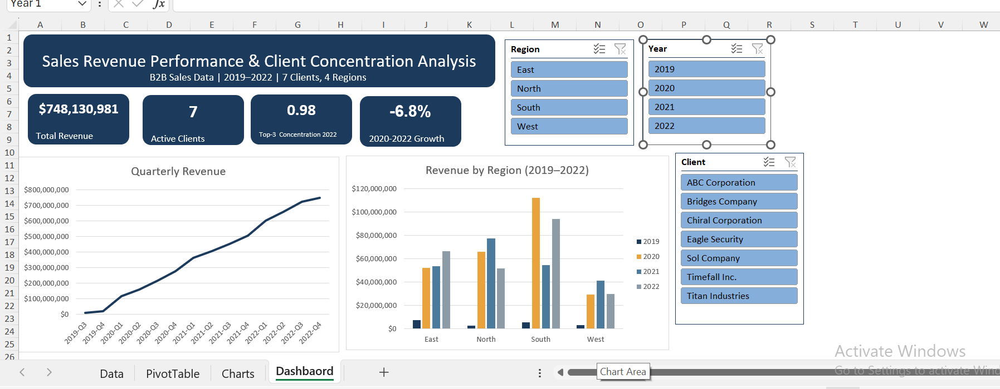
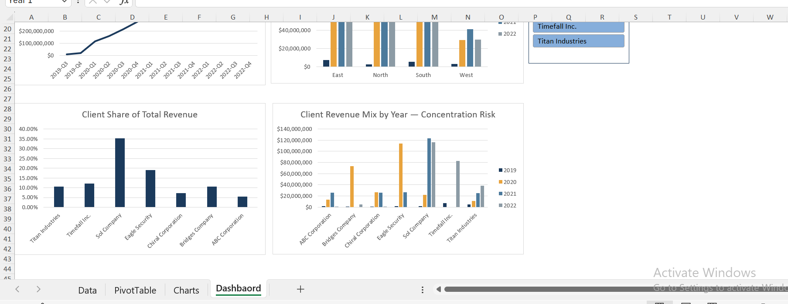

# Sales Revenue Performance & Client Concentration Analysis

An Excel-based analysis of B2B sales performance across regions and clients from 2019–2022, built to answer a real business question: **is revenue growing, and how exposed is the business to client concentration risk?**

---

## Business Context

The company sells to 7 major corporate clients across 4 regions (North, South, East, West). Leadership wants to understand how revenue has trended since 2019, which regions and clients are driving performance, and — critically — how reliant the business has become on a small number of key accounts.

## Business Question

> How has revenue performed and grown across regions and clients from 2019–2022, and how exposed is the business to client concentration risk?

## Dataset

- 714 transactions, July 2019 – October 2022
- Fields: Date, Client, Region, Month, Year, Quarter, Amount
- 7 clients, 4 regions
- **Note:** 2019 is a partial year (July–December, 7 months only). Any comparison involving 2019 is treated as a partial-year baseline, not a full-year figure, throughout this analysis.
- Data was validated prior to analysis: 0 missing values, 0 duplicate rows, 0 negative/zero amounts, and full consistency between the Date field and the Year/Month/Quarter fields.

## Tools & Skills Used

- Excel PivotTables and PivotCharts
- Slicers connected across multiple PivotTables (Region, Year, Client)
- Formula-driven KPIs (`SUMIFS`, `SUMPRODUCT`/`LARGE`, `COUNTA`, `GETPIVOTDATA`)
- Custom Excel theme and dashboard design
- Data validation and quality documentation

## Methodology

1. Validated the raw transaction data for completeness and consistency
2. Added two calculated helper fields (`YearQuarter`, `PartialYear`) as live formulas to support time-series analysis and to flag the partial 2019 baseline
3. Built four PivotTables: quarterly revenue trend with running total, revenue by region and year, client revenue ranking, and client revenue by year
4. Calculated a **Top-3 Client Concentration Ratio** per year — the share of total annual revenue coming from the 3 largest clients — using `SUMPRODUCT(LARGE(...))` against the pivoted client totals
5. Built four PivotCharts and a KPI summary, connected via slicers, into a single interactive dashboard

## Key Findings

- **Total revenue (2019–2022): $748,130,981** across 714 transactions
- **Revenue declined ~6.8% from 2020 to 2022** ($259,996,254 → $242,337,256), despite 2021 and 2022 both individually outperforming the partial 2019 baseline — growth was not sustained past its 2020 peak
- **Client concentration rose sharply: the top 3 clients accounted for 98% of total revenue in 2022**, up from 74% in 2019 and 82% in 2020. Revenue is increasingly dependent on a shrinking set of accounts
- **Sol Company alone accounts for 35.2% of total revenue** across the full period — the single largest client relationship in the portfolio, followed by Eagle Security (19.0%) and Timefall Inc. (12.1%)
- Regional performance was uneven: **South was the strongest-growing region**, while performance in other regions was comparatively flat or declined over the period

**Taken together, the flat-to-declining revenue trend and the sharp rise in client concentration point to the same underlying risk: growth increasingly depends on retaining a small number of large accounts, not on a broadening client base.**

## Dashboard

The dashboard combines four KPI cards (Total Revenue, Active Clients, Top-3 Concentration, 2020–2022 Growth) with four linked PivotCharts — quarterly revenue trend, revenue by region, client revenue share, and client revenue mix by year — filterable via Region, Year, and Client slicers.

## Recommendations

1. **Prioritize account retention for the top 3 clients** (Sol Company, Eagle Security, Timefall Inc.) — losing any one of them would materially impact total revenue given their combined ~66% share
2. **Invest in client diversification**, particularly in underperforming regions, to reduce dependency risk and rebuild the revenue base that existed in 2019–2020
3. **Investigate the 2020→2022 revenue decline** at the client and regional level to identify whether it reflects lost accounts, reduced order volume, or broader market conditions — the current dataset doesn't distinguish the cause, only the trend
4. **Set a concentration threshold as an ongoing metric** (e.g. flag if top-3 concentration exceeds 80%) so risk is monitored going forward rather than discovered retrospectively

## How to Reproduce

1. Open `excel/Sales_Revenue_Performance_Analysis.xlsx`
2. Raw/cleaned data lives in the `Data` sheet as an Excel Table (`SalesData`)
3. PivotTables are on the `PivotTable` sheet; PivotCharts on `Charts`
4. The interactive dashboard is on the `Dashboard` sheet — use the slicers to filter by Region, Year, or Client
5. Raw cleaned data is also available standalone as `data/sales_data_2019_2022.csv`

## Author

[Favour Ibe] · [LinkedIn] · [[GitHub](https://github.com/favibe)]

---

*This project is part of a data analytics portfolio. See also: [Online Retail Sales Analysis](https://github.com/favibe/online-retail-sales-analysis) — a Power Query/Power Pivot BI dashboard project.*
